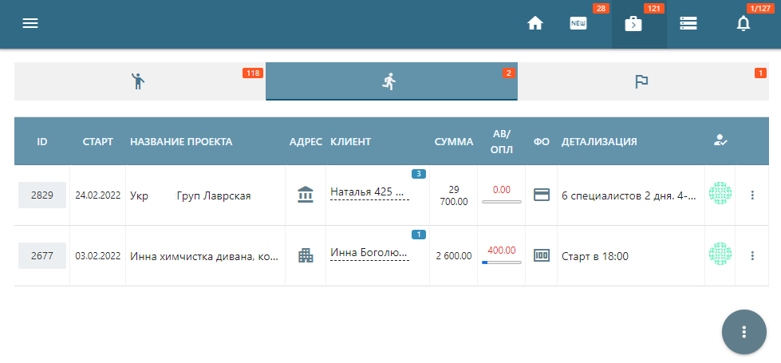

# CRM System Front-End

## The CRM system was created for a cleaning company. It includes:
- collection and storage of information about customers and their orders
- search, filter, add and edit entries
- leading the client from the lead to the completion of the transaction
- formation of sales funnels
- delimited access level
- personnel accounting

## Used:
- React
- Redux
- Axios
- Formik
- Bootstrap